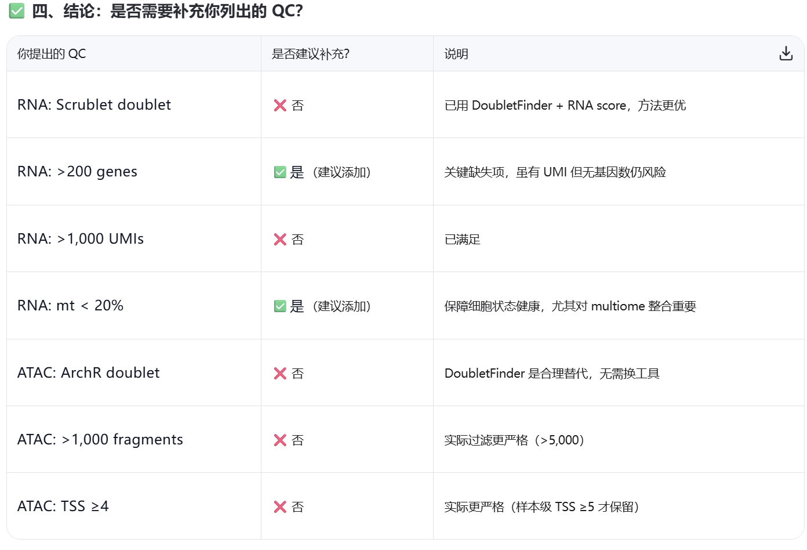

# Data preprocessing for *human fetal brain* data

**Use ctrl+shift+v to visualize this .md file in vscode.**

This repository is to download and transform the *human fetal brain* data into the form to be input into EpiAgent and scGPT.

The paper of this dataset is: 
*Mannens, Camiel CA, et al. "Chromatin accessibility during human first-trimester neurodevelopment." Nature (2024): 1-8.*

GitHub data repository: https://github.com/linnarsson-lab/fetal_brain_multiomics/tree/main.

In *download_data.ipynb*, we select the 10X multiomics data and download each sample into an independent folder by **wget**.

In the folder *preprocess*, there should be folder *reference* and *model*.
1. (Step 1) Unzip the tar.gz file; Transform atac_fragments.tsv.gz to atac_fragments.bed file.
2. (Step 2) Process RNA data: 
    1) Select cells that are present in the cell metadata (which are usually the cells kept by the quality control);
    2) Further quality control in this data except that in the paper (suggested by LLM);
    3) Extract the ClusterName in the cell matadata as annotation.
3. (Step 3) Process ATAC data: 
    1) Further quality control in this data (none suggested by LLM);
    2) Building atac_fragments_ccre;
    3) Constructing AnnData;
    4) Selecting cells intersecting with RNA;
    5) Tokenizing ATAC data.
4. (Step 4) Build scBank data (input for scGPT) for RNA data.

 Finally, use *load_data.ipynb* to check if the datasets are successfully preprocessed and saved.

Note: 
1. Run step 1 for all samples and then step 2 for all samples, and so on.
2. Use tmux to run *step3_process_atac.sh* and *step4_build_scbank.sh*. Step 3 will take very long time.
3. If there is no *filtered_feature_bc_matrix.h5* or *raw_feature_bc_matrix.h5* object, you should manually formulate the data in the folder *filtered_feature_bc_matrix*, to obtain an AnnData object. Please see **scBLIP/data/preprocess/process_rna.py** for details.
4. The prompt for the suggestion to carry out further quality control:

    一篇文章中的实验产生的10X multiomics数据经过了如下的质量控制：
    TSS enrichment was calculated using pycisTopic51 (TSS window 50 base pairs (bp), flanking window 1,000 bp) as we noticed discernible change in some of the samples after updating Cellranger-arc. Samples with a score below 5 were discarded. For the other samples, nucleus-by-bin matrices were generated at both 5-kb and 20-kb resolution with bins that overlapped with any of the ENCODE blacklist52 being removed. The 5-kb nucleus-by-bin matrix was used for doublet detection using an adapted version of DoubletFinder. In brief, nuclei were co-embedded with 20% artificial doublets to determine a threshold to distinguish doublets from singlets on the basis of their nearest-neighbour network and a doublet score was assigned on the basis of each nucleus’s local neighbourhood. For the multiome samples, the RNA-doublet score was used as it proved slightly more stable. Additionally, the sex of the sample was determined on the basis of the fraction of Y-chromosomal reads (>0.05% for male) as well TSS fraction. Nuclei that were not doublets and had more than 5,000 and fewer than 100,000 fragments, more than 20% TSS fragments and more than 1,000 RNA unique molecular identifiers (UMIs), and at least 10% unspliced RNA UMIs were pooled to generate the main dataset (the final two filters apply only to multiome).

    On average 27,599 high-quality fragments per nucleus were identified with a fragments in peaks ratio of 54%. High-quality nuclei were selected on the basis of the number of fragments and the fraction of fragments overlapping TSS as well as UMI count and splice ratio in multiome samples.

    这样的质量控制对10X multiomics数据严格吗？需不需要在再进行以下的质量控制（或部分）？

    For RNA modality:
    1) Doublets identified via Scrublet24 387 (v0.2.3) with default parameters
    2) Minimum 200 detected genes (nFeature_RNA)
    3) Minimum 1,000 UMIs (nCount_RNA)
    4) Maximum mitochondrial content ratio of 0.2 (calculated from MT-gene subset)

    For ATAC modality:
    1) Doublets identified via ArchR25 393 (v1.0.2) with default parameters
    2) Minimum 1,000 high-quality fragments (nFragments)
    3) Minimum Transcriptional Start Site (TSS) enrichment score of 4

 Example output by Qwen:

 

